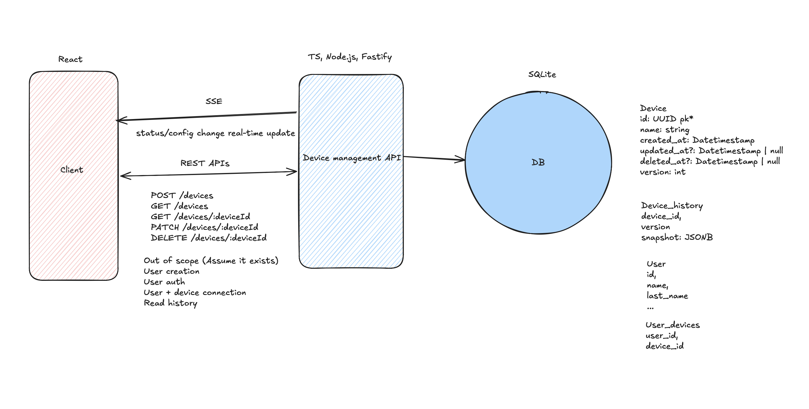

# Device Management API

Objectives:

- Register a New Device:
  Create an endpoint to register a new IoT device. The API should accept the necessary details to uniquely identify and describe the device.
  The response should return the details of the registered device, including a unique identifier.
- List All Devices:
  Implement an endpoint to retrieve a list of all registered devices. This endpoint should return a summary of each device's details.
- Get Device Details:
  Create an endpoint to retrieve the details of a specific device by its unique identifier.
- Update Device Status:
  Provide an endpoint to update the status or configuration of a specific device. This could be used, for example, to turn a light on or off, adjust a thermostat, etc.
  The response should confirm the updated status or configuration.
- Delete a Device:
  Implement an endpoint to delete a specific device from the system. The response should confirm the deletion.
- Device History
- Frontend UI for all operations

---

## Tech Stack

| Layer   | Technology           |
| ------- | -------------------- |
| Backend | TypeScript + Fastify |
| ORM     | Drizzle ORM          |
| Database| SQLite               |
| Frontend| React + MUI          |
| Testing | Vitest               |

---

## Architecture & Key Design Decisions

**Auth simulation** — User creation and auth are out of scope. At startup, 2–3 users are seeded into the DB. All requests require an `X-User-Id` header; a Fastify `preHandler` validates it against seeded users and attaches the user to the request context. The React UI provides a user-switcher in the top bar — open two browser windows with different users to observe SSE updates live.

**Soft deletes** — Devices are never hard-deleted. `DELETE /devices/:deviceId` sets `deleted_at`; all list and detail endpoints filter `WHERE deleted_at IS NULL`.

**Desired / actual state (IoT shadow pattern)** — `PATCH` writes the requested change to a `desired` JSON column and returns immediately. A simulated device acknowledgement fires ~1.5 s later: the server reads `desired`, merges it into `actual`, clears `desired`, and broadcasts the updated device via SSE. This mirrors how AWS IoT Device Shadow works — the cloud accepts commands instantly, and the physical device applies them asynchronously. The frontend displays the device's confirmed `actual` state and receives the live update over SSE with no polling needed.

Version is managed server-side and incremented on every write (both on PATCH and on sync). Clients never supply a version; the field is exposed in the API for audit and history purposes only.

**Device History** — Every successful `PATCH` writes a full JSON snapshot of the device state to `DeviceHistory`. Reading history is out of scope (no GET endpoint), but the audit trail is persisted for future use.

**Real-time updates (SSE)** — The server holds an in-memory `Map<deviceId, Set<Response>>`. On successful `PATCH` and again after the sync completes, all subscribers of that device receive a `device-updated` event.

**Configuration** — Stored inside the `actual` JSON column, making it flexible across device types (lights, thermostats, cameras) without schema migrations. Defaults to `{ brightness: 100, mode: "auto" }` if not provided on create.

---

## API Endpoints

| Method | Path                        | Description                              |
| ------ | --------------------------- | ---------------------------------------- |
| POST   | `/devices`                  | Register a new device                    |
| GET    | `/devices`                  | List all devices for the requesting user |
| GET    | `/devices/:deviceId`        | Get a specific device by ID              |
| PATCH  | `/devices/:deviceId`        | Send a command to the device             |
| DELETE | `/devices/:deviceId`        | Soft-delete a device                     |
| GET    | `/devices/:deviceId/events` | SSE stream for real-time device updates  |

### Request / Response shapes

**POST /devices**

```json
// Request
{ "name": "Living Room Light", "status": "enabled", "configuration": { "brightness": 80 } }

// Response 201
{
  "id": "uuid",
  "name": "Living Room Light",
  "status": "enabled",
  "configuration": { "brightness": 80 },
  "desired": null,
  "version": 0,
  "createdAt": "..."
}
```

**PATCH /devices/:deviceId**

```json
// Request — desired fields only, no version required
{ "status": "off" }

// Response 200 — desired is set, actual (status) is still the confirmed state
{
  "id": "uuid",
  "name": "Living Room Light",
  "status": "enabled",
  "configuration": { "brightness": 80 },
  "desired": { "status": "off" },
  "version": 1,
  "updatedAt": "..."
}

// ~1.5 s later, SSE broadcasts the synced state
{
  "id": "uuid",
  "status": "off",
  "configuration": { "brightness": 80 },
  "desired": null,
  "version": 2,
  "updatedAt": "..."
}
```

---

## Core Entities

```
Device
  id              uuid (PK)
  name            string
  actual          JSON  ← confirmed device state { status, configuration }
  desired         JSON  ← pending command { status?, configuration? } | null
  version         integer (incremented on every write)
  created_at      timestamp
  updated_at      timestamp
  deleted_at      timestamp (null until soft-deleted)

DeviceHistory
  device_id       uuid (FK → Device)
  version         integer
  snapshot        JSON  ← full device state at this version
  created_at      timestamp

User
  id              uuid (PK)
  name            string
  created_at      timestamp

User_Device
  user_id         uuid (FK → User)
  device_id       uuid (FK → Device)
```

The API flattens `actual` into top-level `status` / `configuration` fields on all responses so the frontend works with a simple, flat shape.

**Out of scope (assumed to exist)**

- User creation & authentication
- User–device connection management
- Reading device history

https://excalidraw.com/#json=4nrLcnWo0jYhfGh7Xc7xv,cdptIrjryoad1Ov_3QaAqA


---

## Running Locally

**Prerequisites:** Node.js 20+, npm

```bash
# Install dependencies
npm install

# Start backend (http://localhost:3000)
npm run dev:server

# Start frontend in a separate terminal (http://localhost:5173)
npm run dev:client
```

The database file (`db.sqlite`) is created automatically on first run. Seeded user IDs are printed to the console on startup — use them in the UI user-switcher.

**Testing multi-user SSE:** Open `http://localhost:5173` in two browser windows. Select different users in the top bar. Make a change in one window and watch both windows update live as the simulated device acknowledges the command ~1.5 s later.

---

## Test Cases

Tests are written with Vitest, scoped to showcase different testing layers rather than achieve exhaustive coverage.

### Unit Tests — service layer with mocked dependencies

```bash
npm run test:unit
```

Each service function is tested in isolation with a mocked repository:

- `createDevice` — uses `defaultConfiguration` when none provided; creates User_Device links for all seeded users
- `updateDevice` — writes desired state without touching actual; increments version; broadcasts SSE on success
- `deleteDevice` — sets `deleted_at`; returns 404 for unknown or unowned device
- `listDevices` — excludes soft-deleted devices

### Integration Tests — full request/response against real SQLite

```bash
npm run test:integration
```

- `POST /devices` → returns device with generated uuid and `version: 0`
- `PATCH /devices/:deviceId` → sets `desired` state, returns updated device with incremented version and unchanged `actual.status`
- `DELETE /devices/:deviceId` → subsequent `GET /devices` excludes the device

### E2E — single happy-path flow

```bash
npm run test:e2e
```

Register device → send PATCH command → assert `desired.status` set and `actual.status` unchanged → assert version incremented → assert `DeviceHistory` row written.

### Run all tests

```bash
npm test
```
